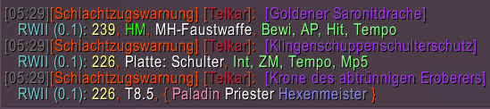

# wow-RaidWarningItemInfo-dev
Tiny WoW 3.3.5 addon, which displays information for items posted in Raid Warning

  

## [Releases](https://github.com/telkar-rg/wow-RaidWarningItemInfo-dev/releases)
#### [RWII v0.1](https://github.com/telkar-rg/wow-RaidWarningItemInfo-dev/releases/tag/v0.1)
- Initial public testing version
